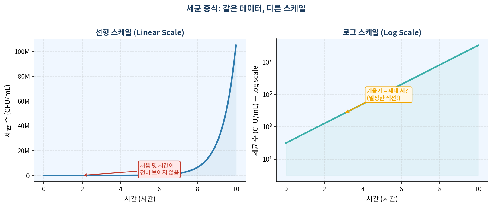
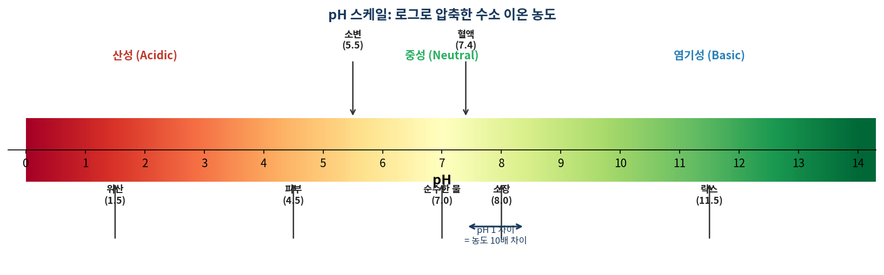
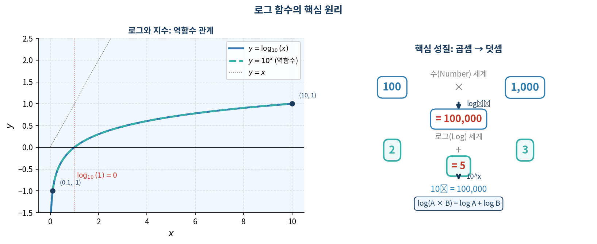
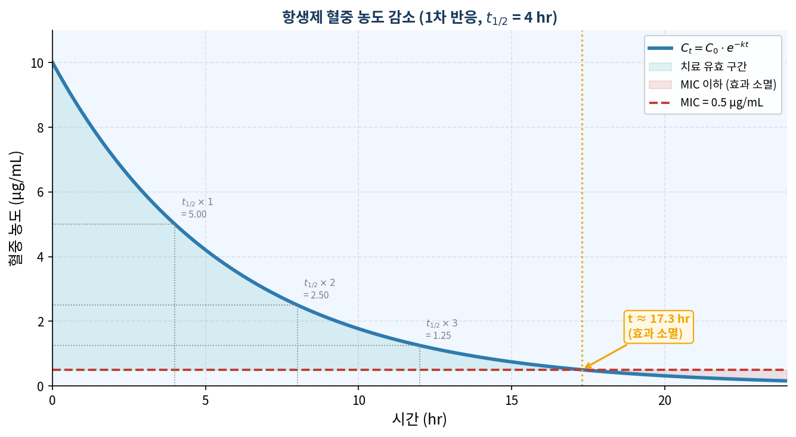

# 학습 목표

이 챕터를 마치면 다음을 할 수 있다:

1. 로그가 왜 발명되었는지, 어떤 문제를 해결하는지 설명할 수 있다
2. 상용로그와 자연로그의 정의를 적용하여 기본 계산을 수행할 수 있다
3. pH 계산, 세균 세대 시간, 농도 비율 문제를 로그로 풀 수 있다
4. Nernst 방정식, qPCR 효율, Gibbs Free Energy 등 전공 수식을 계산할 수 있다

**선수 지식:** 지수 함수의 기본 개념 ($10^n$ 형태), 자연수 $e$의 정의

---

# 1. 왜 배우는가 — 로그의 탄생

## 1614년, 천문학자들의 고통

16세기 유럽의 천문학자들은 행성 궤도를 계산하는 데 인생을 소비했다. 튀코 브라헤(Tycho Brahe)가 20년에 걸쳐 쌓은 관측 데이터를 요하네스 케플러(Johannes Kepler)가 물려받았을 때, 케플러 앞에는 수십 자리짜리 숫자들의 곱셈과 나눗셈이 산처럼 쌓여 있었다.

당시 큰 수의 곱셈은 지금의 우리가 상상하기 어려운 수작업이었다. 예를 들어:

$$123{,}456{,}789 \times 987{,}654{,}321 = ?$$

이것을 손으로 계산하면 수십 분이 걸렸다. 천문학자 한 명이 하루에 처리할 수 있는 계산은 손에 꼽을 정도였다. 케플러의 스승 튀코 브라헤는 "계산 실수로 인한 오류가 관측 오류보다 더 많다"고 탄식했다.

스코틀랜드 수학자 **존 네이피어(John Napier)**는 이 문제를 20년 동안 생각했다. 그가 1614년에 발표한 해법의 핵심은 놀랍도록 단순한 관찰에서 출발한다:

$$10^2 \times 10^3 = 10^{2+3} = 10^5$$

**지수끼리는 더하면 된다.** 곱셈이 덧셈으로 바뀐다. 수십 자리 숫자를 곱하는 대신, 그 숫자가 "10의 몇 제곱인가"만 찾아서 더하면 된다. 이것이 로그(logarithm — '비율의 수'라는 뜻)의 탄생이다.

로그표(log table) 하나로 천문학자들의 계산 시간이 $\frac{1}{10}$로 줄었다. 수학자 피에르 시몽 라플라스(Pierre-Simon Laplace)는 후에 이렇게 말했다: *"로그의 발명은 천문학자들의 수명을 두 배로 늘렸다."*

## 생명이 로그를 쓰는 이유

흥미로운 것은, 인간이 로그를 편의를 위해 발명하기 훨씬 전부터 **생명체는 이미 로그 방식으로 세상을 인식하고 있었다**는 사실이다.

### 감각 기관: 로그 수용기

촛불 하나가 켜진 방에 촛불을 하나 더 추가하면 확연히 밝아진다. 그런데 이미 100개의 촛불이 켜진 방에 촛불을 하나 더 추가해도 거의 아무 차이를 느끼지 못한다. 자극이 같아도 느끼는 변화가 다르다.

독일 물리학자 구스타프 페히너(Gustav Fechner)가 1860년에 수학적으로 정리한 **베버-페히너 법칙(Weber-Fechner Law)**:

$$\text{감각의 크기} = k \times \log\!\left(\frac{\text{자극의 세기}}{\text{기준 자극}}\right)$$

생명체가 왜 이렇게 진화했는가? 생존 때문이다. 풀숲에서 바스락거리는 소리(약한 자극)도 듣고, 천둥소리(강한 자극)에도 귀가 망가지지 않아야 한다. 선형적 감각 체계라면 강한 자극에서 감각이 포화되거나, 약한 자극을 아예 감지하지 못한다. 로그 스케일 덕분에 생명체는 $10^{-12}$W/$\text{m}^2$의 속삭임부터 $10^2$W/$\text{m}^2$의 폭발음까지, **14자리 범위**의 소리를 하나의 감각 체계로 처리한다.

### 세포: 기하급수적 성장과 로그

대장균 하나가 적합한 환경에서 20분마다 분열한다. 1개 → 2개 → 4개 → 8개...

1시간 후: $2^3 = 8$마리
6시간 후: $2^{18} = 262{,}144$마리
12시간 후: $2^{36} = 68{,}719{,}476{,}736$마리 (약 690억 마리)

이 변화를 선형 그래프(y축이 개체 수)로 그리면, 처음 몇 시간은 x축에 납작하게 붙어 있고, 마지막 1~2시간에 그래프가 수직으로 솟구친다. 세균 증식의 어떠한 패턴도 보이지 않는다.

**로그 스케일로 바꾸면:** 기하급수적 증가가 직선이 된다. 직선의 기울기 하나가 세균의 증식 속도(세대 시간)를 알려준다. 항생제를 처리했을 때 기울기가 감소하면 효과가 있는 것이고, 변화가 없으면 내성이 생긴 것이다.

### 생화학: 극단적 농도 차이의 압축

세포는 수백 가지의 화학물질을 동시에 다루는데, 그 농도 범위가 극단적이다.

| 물질 | 세포 내 농도 |
|------|------------|
| 수소 이온 ($\text{H}^+$) — 위산 | $10^{-2}$ M |
| 수소 이온 ($\text{H}^+$) — 혈액 | $10^{-7}$ M |
| 수소 이온 ($\text{H}^+$) — 소장 | $10^{-8}$ M |
| ATP | $10^{-3}$ M |
| 이차전령 cAMP | $10^{-7}$ M |

위산과 혈액의 수소 이온 농도 차이는 $10^5 = 100{,}000$배다. 이 숫자들을 같은 축에 표시하려면 축이 수십 km가 되어야 한다. 로그를 취하면 2와 7이라는 간결한 숫자가 된다 — 이것이 pH다.

**로그는 "극단적으로 다른 크기의 세계를 인간이 다룰 수 있는 범위로 압축하는 번역기"다.**

---

# 2. 개념 전개 — 직관에서 계산까지

## 2.1 직관: 역함수로서의 로그

지수함수 $f(x) = 10^x$는 "10을 $x$번 곱하라"는 명령이다.

- $10^2 = 100$: "10을 2번 곱하면 100"
- $10^3 = 1{,}000$: "10을 3번 곱하면 1,000"

로그는 이 질문을 뒤집는다: **"100을 만들려면 10을 몇 번 곱해야 하나?"**

$$\log_{10}(100) = 2 \qquad \log_{10}(1{,}000) = 3$$

이것이 핵심이다. 로그는 지수함수의 **역함수**다. 지수가 결과를 만든다면, 로그는 결과로부터 지수를 꺼낸다.

그리고 여기서 네이피어의 통찰이 빛난다:

$$100 \times 1{,}000 = 100{,}000$$
$$\log_{10}(100) + \log_{10}(1{,}000) = 2 + 3 = 5 \quad \Rightarrow \quad 10^5 = 100{,}000 \checkmark$$

곱하는 대신 **더한다.** 이 성질 하나가 로그의 모든 힘이다.

## 2.2 정의

**상용로그 (Common Logarithm)**

$$\log_{10}(x) = y \;\Longleftrightarrow\; 10^y = x \qquad (x > 0)$$

각 요소의 의미:
- **밑(base) = 10**: 생물학, 화학에서 pH, dB 등 10진 스케일에 적합
- **진수 $x$**: 반드시 양수 — 농도, 개체 수, 에너지는 음수가 될 수 없다
- **로그값 $y$**: "지수를 꺼낸 것" — 음수도 가능 ($10^{-3} = 0.001$이므로 $\log_{10}(0.001) = -3$)

**자연로그 (Natural Logarithm)**

$$\ln(x) = \log_e(x) \qquad (e \approx 2.71828\ldots)$$

왜 $e$인가? 연속적으로 변하는 현상 — 세포 분열, 방사성 붕괴, 약물 농도 변화, 신경 신호 — 은 자연적으로 $e$를 기반으로 한 미분방정식으로 기술된다. $y = e^{kt}$를 미분하면 $y' = ke^{kt} = ky$, 즉 *"변화율이 현재 양에 비례한다"*는 모든 성장/감소 현상의 공통 구조다.

**변환 관계:**

$$\ln(x) = 2.303 \times \log_{10}(x)$$

## 2.3 핵심 성질 — 왜 성립하는가

| 성질 | 수식 | 근거 |
|------|------|------|
| 곱셈 → 덧셈 | $\log(A \times B) = \log A + \log B$ | $10^m \times 10^n = 10^{m+n}$ |
| 나눗셈 → 뺄셈 | $\log(A/B) = \log A - \log B$ | $10^m \div 10^n = 10^{m-n}$ |
| 지수 → 계수 | $\log(A^n) = n\log A$ | $(10^m)^n = 10^{mn}$ |
| 기준값 | $\log_{10}(1) = 0,\quad\log_{10}(10) = 1$ | $10^0=1,\;10^1=10$ |
| 밑 변환 | $\log_b(x) = \dfrac{\ln x}{\ln b}$ | 역함수 합성 |

> **직관적 이해:** 로그는 "지수들의 세계"로 들어가는 문이다. 지수 세계에서 곱셈은 덧셈이고, 나눗셈은 뺄셈이다. 로그표가 발명되기 전에는 12자리 숫자 두 개를 곱하는 데 한 시간이 걸렸다. 로그표가 있으면 30초면 된다.

## 2.4 계산 예시 — 세 가지 핵심 패턴

### 패턴 1: 정의를 직접 적용

**pH = 4인 용액의 $[\text{H}^+]$는?**

$$\text{pH} = -\log_{10}[\text{H}^+] = 4 \;\Rightarrow\; \log_{10}[\text{H}^+] = -4 \;\Rightarrow\; [\text{H}^+] = 10^{-4}\,\text{M}$$

**해석:** pH가 1 단위 증가할 때마다 $[\text{H}^+]$는 **10배 감소**한다. 위산(pH 2)과 혈액(pH 7)의 차이는 $10^5 = 100{,}000$배다. 이 차이를 유지하는 데 세포는 엄청난 에너지를 쏟는다.

### 패턴 2: 지수 방정식을 로그로 풀기

**대장균 배양:** $N_0 = 10^3$ CFU/mL → 6시간 후 $N = 10^6$ CFU/mL. 세대 시간은?

$$N = N_0 \times 2^{t/g} \;\Rightarrow\; 2^{6/g} = \frac{10^6}{10^3} = 10^3$$

양변에 $\log_{10}$을 취한다:

$$\frac{6}{g} \times \underbrace{\log_{10}2}_{0.3010} = 3 \;\Rightarrow\; \frac{6}{g} = \frac{3}{0.3010} = 9.97 \;\Rightarrow\; g = 0.60\,\text{시간} = 36\,\text{분}$$

**해석:** 실제 대장균 세대 시간은 약 20분(최적 조건). 36분이면 조금 느린 성장 — 배지가 최적이 아니거나, 초기 적응(lag phase)이 포함됐을 수 있다.

### 패턴 3: 로그 성질로 분수 농도 처리

**용액 B의 $[\text{H}^+]$가 용액 A의 40배, pH$_A$ = 4.2일 때 pH$_B$는?**

"40배"라는 곱셈이 등장했다. 로그의 곱셈→덧셈 성질을 바로 적용한다:

$$\text{pH}_B = -\log_{10}(40 \times [\text{H}^+]_A) = -\log_{10}40 - \log_{10}[\text{H}^+]_A$$

$$= -\log_{10}40 + \text{pH}_A$$

$$\log_{10}40 = \log_{10}(4 \times 10) = \underbrace{2\log_{10}2}_{0.602} + 1 = 1.602$$

$$\text{pH}_B = 4.2 - 1.602 = 2.6$$

**해석:** 농도가 40배 증가했지만 pH는 겨우 1.6 감소했다. 로그 스케일의 "압축" 효과 — 40배라는 큰 차이가 1.6이라는 작은 숫자로 표현된다.

---

# 3. 전공 수준 문제

각 문제는 실제 연구·임상·산업 현장에서 사용되는 수식을 기반으로 한다.
모든 상수값은 국제 표준(NIST, IUPAC) 기준이다.

---

## [문제 1] 신경생리학: Nernst 방정식과 칼륨 평형 전위

### 개념 배경

**Nernst 방정식(Nernst Equation)**은 세포막을 경계로 특정 이온의 농도 차이가 존재할 때, 그 이온만이 자유롭게 투과한다면 전기적으로 평형을 이루는 전위(equilibrium potential)를 계산하는 공식이다.

신경세포 안의 칼륨 이온($\text{K}^+$) 농도는 세포 밖보다 약 **28배 높다** (140 mM vs. 5 mM). 이 농도 기울기는 세포가 능동적으로 에너지를 써서 유지한다. 이온 채널이 열리면 $\text{K}^+$는 농도 기울기를 따라 세포 밖으로 빠져나가려 하는데, 이 이동이 세포 내부를 음전위로 만든다. 전위가 충분히 낮아지면 전기적 반발력이 농도 기울기와 균형을 이루어 이동이 멈춘다 — 이 균형점이 Nernst 전위다.

**왜 중요한가?** 마취제, 항경련제(간질약), 심장 부정맥 약물은 모두 이온 채널을 조절하는 방식으로 작동한다. Nernst 전위를 알아야 채널 차단이 신경 신호에 어떤 영향을 미칠지 예측할 수 있다. 실제로 전신마취제 설계 시 $\text{K}^+$ 및 $\text{Cl}^-$ 채널의 Nernst 전위가 기준점이 된다.

### 문제

$$E = \frac{RT}{zF} \ln \frac{[\text{Ion}]_{out}}{[\text{Ion}]_{in}}$$

**조건:**

- 온도: 37°C (= 310 K)
- $[\text{K}^+]_{out} = 5\,\text{mM},\quad [\text{K}^+]_{in} = 140\,\text{mM}$
- $R = 8.314\,\text{J/(mol·K)},\quad F = 96{,}485\,\text{C/mol},\quad z = +1$
- $\ln x = 2.303\,\log_{10}x,\quad \log_{10}2 = 0.3010,\quad \log_{10}7 = 0.8451$

**질문:**

(1) $\text{K}^+$ 평형 전위를 mV 단위로 계산하시오.

(2) 결과가 음수인 이유를 이온의 이동 방향으로 설명하시오.

(3) 체온이 37°C에서 42°C (= 315 K)로 상승(고열)하면 평형 전위는 어느 방향으로 변하는지, 그 의미를 신경 흥분성 관점에서 논하시오.

*힌트:* $RT/F$를 먼저 계산하고, $\log_{10}(5/140) = \log_{10}5 - \log_{10}140$으로 분해하라. $\log_{10}5 = 1 - \log_{10}2$임을 활용하라.

---

## [문제 2] 분자생물학: qPCR 증폭 효율 결정

### 개념 배경

**실시간 PCR(qPCR)**은 DNA 또는 RNA를 증폭하면서 동시에 형광 신호로 그 양을 실시간 측정하는 기술이다. 2020년 코로나19 팬데믹에서 전 세계가 매일 수억 건씩 사용한 방법이다. 암 진단에서는 종양 억제 유전자의 발현량을, 식품 안전에서는 식품 내 병원균 오염 여부를 정량하는 데 쓰인다.

PCR의 매 사이클마다 DNA가 이론적으로 2배씩 늘어난다. 그러나 현실에서 효율은 1.8~2.0 사이에 분포하며, 효율을 정확히 모르면 초기 DNA 양 계산에 심각한 오류가 생긴다. 효율 1.8과 2.0의 차이는 30사이클 후 $1.8^{30}$ vs $2^{30}$, 즉 약 **4배**의 정량 오차를 만든다.

$C_q$ (Cycle quantification threshold)는 형광 신호가 배경 잡음을 넘는 사이클 번호다. 초기 DNA가 많을수록 빨리 신호가 나타나므로 $C_q$가 낮다. 로그 관계 덕분에 $C_q$와 $\log_{10}N_0$ 사이에는 선형 관계가 성립하며, 그 기울기에서 효율을 역산한다.

### 문제

$$C_q = -\frac{1}{\log_{10} E}\,\log_{10} N_0 + K$$

**실험 결과:** 표준 시료를 10배씩 희석하며 측정한 결과, $C_q$ vs $\log_{10}N_0$ 그래프의 기울기 = **−3.32**

**질문:**

(1) 이 실험의 증폭 효율 $E$를 구하시오.

(2) 완벽한 증폭($E = 2$)일 때 이론적 기울기를 계산하고, 실험값과 비교하여 이 실험의 품질을 평가하시오.

(3) $E < 2$로 측정되는 실험상 원인을 두 가지 이상 제시하고, 각 원인의 해결 방법을 설명하시오.

$(\log_{10}2 = 0.3010)$

*힌트:* 기울기 $= -1/\log_{10}E$ 이므로 $\log_{10}E = 1/|{\text{기울기}}|$로 역산하라.

---

## [문제 3] 생화학: ATP 가수분해의 실제 $\Delta G$

### 개념 배경

ATP(아데노신 삼인산)는 세포의 에너지 화폐다. 성인 인간은 하루 동안 자신의 체중과 맞먹는 양의 ATP를 합성하고 분해한다. ATP → ADP + $\text{P}_i$ 반응에서 방출되는 에너지로 근육 수축, 이온 펌프, 단백질 합성이 구동된다.

**표준 자유 에너지($\Delta G^\circ$)**는 모든 반응물과 생성물의 농도가 1 M이고 온도가 25°C인 표준 조건에서 측정한 값이다. 그러나 실제 세포 내 ATP 농도는 2~5 mM, ADP는 0.1~1 mM 수준으로 1 M과는 전혀 다르다.

van't Hoff 등온식($\Delta G = \Delta G^\circ + RT\ln Q$)은 실제 농도 조건에서의 자유 에너지를 계산한다. 실제 세포에서 ATP 가수분해의 $\Delta G$는 $-50$ ~ $-60\,\text{kJ/mol}$로, 표준값 $-30.5\,\text{kJ/mol}$보다 훨씬 크다. 세포가 ATP/ADP 비율을 높게 유지함으로써 반응을 더 자발적으로 만드는 것이다.

격렬한 운동 직후 ATP가 고갈되면 이 비율이 무너지고 $\Delta G$의 절댓값이 감소하여 세포가 필요한 일을 하기 어려워진다 — 근육 피로의 분자적 원인이다.

### 문제

$$\Delta G = \Delta G^\circ + RT\ln\frac{[\text{ADP}][\text{P}_i]}{[\text{ATP}]}$$

**조건:**

- $\Delta G^\circ = -30.5\,\text{kJ/mol}$, $T = 298\,\text{K}$, $R = 8.314 \times 10^{-3}\,\text{kJ/(mol·K)}$
- $[\text{ATP}] = 2.25\,\text{mM}$, $[\text{ADP}] = 0.25\,\text{mM}$, $[\text{P}_i] = 1.65\,\text{mM}$
- $\ln x = 2.303\,\log_{10}x$
- $\log_{10}2 = 0.3010,\;\log_{10}3 = 0.4771,\;\log_{10}5 = 0.6990,\;\log_{10}11 = 1.0414$

**질문:**

(1) 반응 지수 $Q = [\text{ADP}][\text{P}_i]/[\text{ATP}]$를 계산하고, $\Delta G$를 구하시오.

(2) 이 반응이 자발적인지 판단하고, $\Delta G^\circ$보다 $\Delta G$가 더 음수인 이유를 $Q < 1$의 의미와 연결지어 설명하시오.

(3) 격렬한 운동으로 ATP가 빠르게 소모되어 $[\text{ATP}] = 0.5\,\text{mM}$, $[\text{ADP}] = 2.0\,\text{mM}$이 된다면 $\Delta G$가 어떻게 변할지 (증가/감소/방향) 예측하고 그 생리학적 의미를 설명하시오. (계산 불필요)

*힌트:* $Q$를 계산한 뒤 $\log_{10}Q$를 구하고, $RT = 8.314\times10^{-3}\times298$을 먼저 계산하라.

---

## [문제 4] 생물정보학: BLAST Log-odds Score

### 개념 배경

사람의 유전자와 침팬지의 유전자는 얼마나 비슷할까? 어떤 단백질이 암을 억제하는지 어떻게 알 수 있을까? 이런 질문에 답하는 가장 기본적인 도구가 **BLAST(Basic Local Alignment Search Tool)**다.

BLAST는 입력된 단백질·DNA 서열을 수억 개의 데이터베이스 서열과 비교하여 가장 유사한 것을 찾아낸다. 하루 수백만 건의 쿼리를 처리하는 생물정보학의 구글이라고 할 수 있다.

비교의 핵심은 **점수 시스템**이다. 두 서열에서 같은 위치에 아미노산 A와 B가 있다면, "A가 B로 진화적으로 치환되는 것이 얼마나 흔한가?"를 점수로 매긴다. 이것이 **Log-odds Score**:

$$S_{ij} = \lambda\,\log_2\!\frac{q_{ij}}{p_i p_j}$$

- $q_{ij}$: 진화적으로 관련된 서열에서 아미노산 $i$와 $j$가 같은 위치에 실제로 나타나는 빈도
- $p_i p_j$: 무작위 서열에서 두 아미노산이 그 위치에 등장할 기대 빈도(배경 확률)

**왜 로그인가?** 수백~수천 개 위치의 점수를 모두 더해 최종 정렬 점수를 낸다. 확률을 그냥 곱하면 숫자가 $10^{-300}$ 이하로 수렴해 컴퓨터가 처리할 수 없다. 로그를 취하면 곱셈이 덧셈이 되어 수치 안정성이 보장된다.

**왜 $\log_2$인가?** 결과값의 단위가 "비트(bit)"가 된다. 정보이론에서 1비트는 "동전 던지기 한 번의 정보량"이다. 점수가 6비트라면, 이 치환은 무작위보다 $2^6 = 64$배 더 자주 일어난다는 의미다. 이 원리로 만든 **BLOSUM62 행렬**이 오늘날 단백질 서열 정렬의 기본값으로 사용된다.

### 문제

Leucine(L)과 Isoleucine(I)은 구조가 매우 유사한 아미노산으로, 진화적으로 서로 치환되는 빈도가 높다. 특정 데이터셋 분석 결과, L-I 정렬의 관찰 빈도 $q_{ij}$가 무작위 기대 빈도 $p_i p_j$보다 **8배** 높다.

**질문:**

(1) $\lambda = 2$일 때 $S_{ij}$를 구하시오.

(2) $S_{ij} > 0$과 $S_{ij} < 0$이 각각 무엇을 의미하는지, 서열 정렬의 맥락에서 설명하시오.

(3) $q_{ij} = p_i p_j$일 때 (관찰 = 기대) $S_{ij}$는 얼마인가? 이것이 서열 정렬에서 어떤 의미인지 설명하시오.

(4) $\log_2$ 대신 $\log_{10}$을 사용한다면 수치가 어떻게 달라지며, "비트" 해석이 불가능해지는 이유를 설명하시오.

*힌트:* $\log_2 8 = \log_2 2^3 = 3$

---

## [문제 5] 약물동력학: 항생제 혈중 농도와 투여 설계

### 개념 배경

약이 체내에 들어온 후 어떻게 분포하고 사라지는지 연구하는 학문이 **약물동력학(pharmacokinetics)**이다. 약물 설계에서 가장 중요한 질문은 두 가지다: "언제 다시 투여해야 효과가 유지되는가?" 그리고 "독성이 생기지 않으려면 얼마나 줘야 하는가?"

대부분의 약물은 체내에서 **1차 반응(first-order kinetics)**으로 대사·배출된다:

$$C_t = C_0 \cdot e^{-kt}$$

여기서 $k$는 속도 상수, $t_{1/2} = \ln 2 / k$가 **반감기**다. 반감기는 약물마다 다르다 — 아스피린은 약 15~20분, 일부 항생제는 수 시간, 스테로이드 계열은 수일이다.

**최소 유효 농도(MIC)**는 세균 성장을 억제하는 최소 약물 농도다. 혈중 농도가 MIC 아래로 떨어지면 세균이 다시 증식하기 시작한다. 더 심각한 문제는, 농도가 MIC 근처의 낮은 수준을 오래 유지하면 세균이 약에 대한 내성(resistance)을 획득할 기회가 생긴다는 점이다. 항생제 내성은 현재 전 세계에서 연간 약 127만 명의 사망을 유발하는 공중보건 위기다.

따라서 투여 간격 계산 — "언제 MIC 아래로 떨어지는가" — 은 단순한 수학이 아니라 내성균 발생 예방의 핵심이다.

### 문제

어떤 항생제의 반감기 $t_{1/2} = 4\,\text{hr}$, 초기 혈중 농도 $C_0 = 10\,\mu\text{g/mL}$.
*(연속 감소 모델 $C_t = C_0 \cdot e^{-kt}$ 사용)*

**질문:**

(1) 속도 상수 $k$를 구하시오. $(\ln 2 = 0.693)$

(2) 8시간 후 혈중 농도를 구하시오.

(3) 이 항생제의 MIC $= 0.5\,\mu\text{g/mL}$라면, 약물이 효과를 잃는 시점은 투여 후 몇 시간인지 구하시오. $(\ln 2 = 0.693,\;\ln 5 = 1.609)$

(4) 내성균 발생을 막기 위해 혈중 농도가 MIC 아래로 내려가기 전에 재투여해야 한다면, 이론적으로 몇 시간 간격으로 투여해야 하는가? (3번 결과 활용)

*힌트:* (1) $t_{1/2} = \ln 2 / k$. (3) $C_0 e^{-kt} = \text{MIC}$에서 양변에 $\ln$을 취하면 $-kt = \ln(\text{MIC}/C_0)$이 된다.

---

# 핵심 공식 요약

$$\boxed{\log_{10}(x) = y \;\Longleftrightarrow\; 10^y = x}$$

$$\log(AB) = \log A + \log B \qquad \log\!\left(\frac{A}{B}\right) = \log A - \log B \qquad \log(A^n) = n\log A$$

$$\text{pH} = -\log_{10}[\text{H}^+] \qquad \ln x = 2.303\,\log_{10}x \qquad t_{1/2} = \frac{\ln 2}{k}$$

---

# 참고문헌

1. Napier, J. (1614). *Mirifici Logarithmorum Canonis Descriptio*. Edinburgh.
2. Fechner, G.T. (1860). *Elemente der Psychophysik*. Leipzig: Breitkopf und Härtel.
3. Hille, B. (2001). *Ion Channels of Excitable Membranes* (3rd ed.). Sinauer Associates.
4. Nelson, D.L., & Cox, M.M. (2021). *Lehninger Principles of Biochemistry* (8th ed.). W.H. Freeman. (ATP $\Delta G^\circ$, pH)
5. Madigan, M.T. et al. (2021). *Brock Biology of Microorganisms* (16th ed.). Pearson.
6. Altschul, S.F. et al. (1990). Basic local alignment search tool. *J. Mol. Biol.* 215, 403–410.
7. Bustin, S.A. et al. (2009). The MIQE guidelines. *Clin. Chem.* 55(4), 611–622.
8. Rang, H.P. et al. (2019). *Rang & Dale's Pharmacology* (9th ed.). Elsevier.
9. Murray, C.J.L. et al. (2022). Global burden of bacterial antimicrobial resistance. *Lancet* 399, 629–655.

\newpage

---

# 답지 (Answer Key)

---

## 문제 1 풀이: Nernst 방정식

**(1) $\text{K}^+$ 평형 전위 계산**

**Step 1.** $RT/F$ 계산:

$$\frac{RT}{F} = \frac{8.314 \times 310}{96{,}485} = \frac{2{,}577.3}{96{,}485} = 0.02670\,\text{V} = 26.70\,\text{mV}$$

**Step 2.** $\log_{10}(5/140)$ 계산:

$$\log_{10}5 = \log_{10}\!\frac{10}{2} = 1 - \log_{10}2 = 1 - 0.3010 = 0.6990$$

$$\log_{10}140 = \log_{10}(2 \times 7 \times 10) = 0.3010 + 0.8451 + 1 = 2.1461$$

$$\log_{10}\!\frac{5}{140} = 0.6990 - 2.1461 = -1.4471$$

**Step 3.** 전위 계산 ($\ln$을 $2.303\log_{10}$으로 변환):

$$E = 26.70 \times 2.303 \times (-1.4471) = 26.70 \times (-3.331) \approx -88.9\,\text{mV}$$

$$\boxed{E_{\text{K}^+} \approx -89\,\text{mV}}$$

**(2) 결과가 음수인 이유**

$[\text{K}^+]_{in} \gg [\text{K}^+]_{out}$이므로 $\text{K}^+$는 농도 기울기에 따라 세포 밖으로 이동한다. 양전하($\text{K}^+$)가 빠져나가면 세포 내부가 음전위가 된다. 이 음전위가 $\text{K}^+$ 유출을 억제하여 결국 이온 이동이 멈추는 균형점이 $-89\,\text{mV}$다.

**(3) 고열의 영향**

$T$가 증가하면 $RT/F$가 증가하므로 $|E|$가 커진다 → 평형 전위가 더 음수 방향으로 이동한다. 이는 세포막 전위가 안정 막전위에서 더 멀어지는 것을 의미하며, 이론적으로 신경 흥분 역치(threshold)가 높아진다. 그러나 실제 고열에서는 다수 이온 채널의 복합적 영향으로 오히려 신경 과흥분(경련)이 나타난다.

---

## 문제 2 풀이: qPCR 효율

**(1) 증폭 효율 $E$**

$$\text{기울기} = -\frac{1}{\log_{10}E} = -3.32 \;\Rightarrow\; \log_{10}E = \frac{1}{3.32} = 0.3012$$

$$E = 10^{0.3012} \approx 10^{0.3010} = 2.00$$

$$\boxed{E \approx 2.00}$$

**(2) 완벽한 증폭의 이론적 기울기**

$$\text{기울기}_{E=2} = -\frac{1}{\log_{10}2} = -\frac{1}{0.3010} = -3.322$$

실험값 $-3.32$는 이론값 $-3.322$와 거의 일치한다 → **우수한 효율 (MIQE 기준 허용 범위 $-3.1$ ~ $-3.6$ 내)**.

**(3) $E < 2$의 원인과 해결**

| 원인 | 해결 방법 |
|------|----------|
| 프라이머 이량체(primer dimer) 형성 | 프라이머 서열 재설계, 농도 최적화 |
| 샘플 내 PCR 억제제 (헤모글로빈, 헤파린 등) | 샘플 정제 강화, 희석 사용 |
| 어닐링 온도 부적합 | 온도 구배(gradient) PCR로 최적화 |

---

## 문제 3 풀이: ATP 가수분해 $\Delta G$

**(1) $Q$ 계산 및 $\Delta G$**

$$Q = \frac{[\text{ADP}][\text{P}_i]}{[\text{ATP}]} = \frac{0.25 \times 1.65}{2.25} = \frac{0.4125}{2.25} = 0.1833$$

$$\log_{10}(0.1833) = \log_{10}\!\frac{11}{60} = \log_{10}11 - \log_{10}60$$

$$\log_{10}60 = \log_{10}(4 \times 15) = 2\log_{10}2 + \log_{10}3 + \log_{10}5 = 0.602 + 0.4771 + 0.6990 = 1.778$$

$$\log_{10}(0.1833) = 1.0414 - 1.778 = -0.737$$

$$RT = 8.314 \times 10^{-3} \times 298 = 2.478\,\text{kJ/mol}$$

$$RT\ln Q = 2.478 \times 2.303 \times (-0.737) = 2.478 \times (-1.697) = -4.21\,\text{kJ/mol}$$

$$\Delta G = -30.5 + (-4.21) = -34.7\,\text{kJ/mol}$$

$$\boxed{\Delta G \approx -34.7\,\text{kJ/mol}}$$

**(2) 자발성과 $Q < 1$의 의미**

$\Delta G < 0$이므로 자발적 반응이다. $Q = 0.183 < 1$은 반응이 아직 평형에 도달하지 않았고, 생성물(ADP, $\text{P}_i$) 방향으로 더 반응이 진행될 여력이 있음을 의미한다. 이 여력이 $RT\ln Q < 0$으로 기여하여 $\Delta G$를 $\Delta G^\circ$보다 더 음수로 만든다.

**(3) 운동 후 ATP 고갈 예측**

$[\text{ATP}]$ 감소 + $[\text{ADP}]$ 증가 → $Q$가 커진다 ($Q > 1$ 가능) → $\ln Q > 0$ → $RT\ln Q > 0$ → $\Delta G$의 음수 값이 줄어든다(덜 자발적). 극단적으로는 $\Delta G \to 0$ 근처가 되어 ATP 가수분해가 유효한 일을 하지 못한다 — 근육 피로의 분자적 원인이다.

---

## 문제 4 풀이: BLAST Log-odds Score

**(1) $S_{ij}$ 계산**

$$S_{ij} = \lambda\,\log_2\!\frac{q_{ij}}{p_i p_j} = 2 \times \log_2 8 = 2 \times 3 = 6\,\text{bits}$$

$$\boxed{S_{ij} = 6\,\text{bits}}$$

**(2) $S > 0$ vs $S < 0$**

- $S > 0$: 관찰 빈도 $>$ 기대 빈도 → 진화적으로 이 치환이 **선호됨** (비슷한 성질의 아미노산 간 치환)
- $S < 0$: 관찰 빈도 $<$ 기대 빈도 → 진화적으로 이 치환이 **기피됨** (성질이 매우 다른 아미노산 간 치환)

**(3) $q_{ij} = p_i p_j$ 인 경우**

$$S_{ij} = \lambda\,\log_2\!\frac{p_i p_j}{p_i p_j} = \lambda\,\log_2 1 = 0$$

점수 0은 "이 치환이 무작위와 다를 바 없다"는 의미로, 이 위치는 정렬 품질 판단에 기여하지 않는다.

**(4) $\log_{10}$ 사용 시**

$$S' = 2 \times \log_{10} 8 = 2 \times 0.9031 = 1.806$$

값이 약 3.3배 작아진다 (단위: bit → nat의 변환과 유사). "비트" 해석이 불가능한 이유: 1비트는 $\log_2 2 = 1$로 정의되는데, $\log_{10}$에서는 $\log_{10}2 = 0.3010 \neq 1$이므로 "이진 선택 1회"와의 대응이 끊어진다.

---

## 문제 5 풀이: 약물동력학

**(1) 속도 상수 $k$**

$$k = \frac{\ln 2}{t_{1/2}} = \frac{0.693}{4} = 0.173\,\text{hr}^{-1}$$

**(2) 8시간 후 혈중 농도**

8시간 = 반감기 $\times$ 2이므로:

$$C_8 = C_0 \times \left(\frac{1}{2}\right)^2 = 10 \times \frac{1}{4} = 2.5\,\mu\text{g/mL}$$

$$\boxed{C_8 = 2.5\,\mu\text{g/mL}}$$

**(3) MIC 도달 시점**

$$0.5 = 10 \times e^{-0.173t} \;\Rightarrow\; e^{-0.173t} = 0.05$$

$$-0.173t = \ln(0.05) = \ln\!\frac{1}{20} = -(\ln 4 + \ln 5) = -(2\ln 2 + \ln 5)$$

$$= -(2 \times 0.693 + 1.609) = -2.995$$

$$t = \frac{2.995}{0.173} \approx 17.3\,\text{hr}$$

$$\boxed{t \approx 17.3\,\text{시간}}$$

**(4) 투여 간격**

혈중 농도가 MIC에 도달하는 17.3시간보다 짧은 간격으로 재투여해야 한다. 안전 여유(safety margin)를 고려하면 **16시간 이내**가 권장된다. 실제 임상에서는 MIC의 2~4배 농도(MPC, Mutant Prevention Concentration)를 기준으로 투여 간격을 결정하여 내성 발생을 예방한다.

---

*이 챕터는 Textbook Authoring System을 통해 생성·검증되었습니다.*
